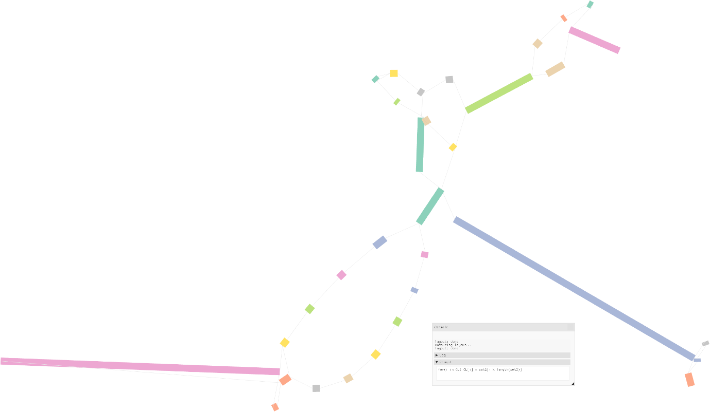
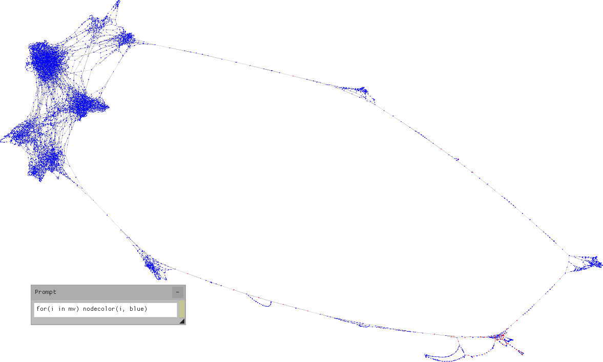

# Strange pangenome scale large graph visualization

Interactive visualization of large genome graphs
in [GFAv1 format](https://github.com/GFA-spec/GFA-spec/blob/master/GFA1.md)
à la [Bandage](https://github.com/rrwick/Bandage).

<p align="center"></p>

Named in reference to the Dr. Strangelove character
in Stanley Kubrick's __Dr. Strangelove or: how I learned to stop
worrying and love the bomb__ (1964),
strangepg provides an interactive visualization of bidirected and undirected graphs
in a familiar force-directed layout but aims to scale to hundreds of millions of nodes and beyond.
Such is the size of pangenome graphs today,
the direct application for this tool.
A big emphasis is placed on performance, reactivity and immediate feedback.
While it currently supports only GFA files as input,
it will in future be extended to support other formats (GraphML, DOT, Newick, etc)
and types of trees (Newick for phylogenetic trees, etc.).

<p align="center"></p>

_Note: this is a work in progress and under heavy development;
significant or breaking changes happen all the time,
but always prefer building from source on the latest commit to
other methods of installation in order to get the latest fixes and
additions. Git tags do **not** mark stable releases.
Please consider this to be a public beta of sorts
and feel free to send bug reports, feature requests or comments.
Thanks!_

<p align="center"></p>

## Table of contents

- [Features](#features)
- [TL;DR](#tldr)
- [Installation](#installation)
  + [Hardware requirements](#hardware-requirements)
  + [Software requirements](#software-requirements)
  + [Bioconda](#bioconda)
  + [Linux](#linux)
  + [MacOS](#macos)
  + [Windows (MinGW64)](#windows-mingw64)
  + [Windows (Cygwin)](#windows-cygwin)
  + [Windows (WSL2)](#windows-wsl2)
  + [OpenBSD](#openbsd)
  + [9front](#9front)
- [Usage](#usage)
  + [Command-line options](#command-line-options)
- [Layouting](#layouting)
  + [Basic layouting](#basic-layouting)
  + [Interaction](#interaction)
  + [Loading from and saving to file](#loading-from-and-saving-to-file)
- [Navigation](#navigation)
- [Graph manipulation](#interaction)
  + [Examples](#examples)
- [Loading tags from CSV files](#loading-tags-from-csv-files)
  + [Format notes](#format-notes)
- [Example applications](#example-applications)
  + [Conga line: linear layout in GFA segments order](#conga-line-linear-layout-in-gfa-segments-order)
  + [Random coordinates](#random-coordinates)
  + [Linear layout using bubble id tags from gaftools](#linear-layout-using-bubble-id-tags-from-gaftools)
- [Known bugs](#bugs)
- [Used and bundled alien software](#bundled)
- [References](#references)


## Features

- Scaling to arbitrarily large graphs via coarsening (not yet merged!); expanding/retracting parts of the graph on-demand with the mouse or object lookups and commands.
- Layouting, rendering, drawing to the screen and handling user interface, file loading, graph manipulation
all in separate and independent threads to reduce any waiting time to a minimum;
immediate output and interaction whenever possible.
- Layouting is in real time and can be interrupted or influenced by moving nodes; it can be saved to or loaded from a file as a final result or an initial/reproducible state, hence guiding/improving previous layouts is possible; tags such as color can be changed at any time.
- High performance graphics with modern and efficient renderer.
- Fast GFA loading by splitting topology from sequence/tags in separate passes;
no assumptions about ordering, type of labels (strings or integers) or tags.
- Console with an embedded graph manipulation language based on GFA tags.
- Any tags, including user-defined ones, can be loaded from the GFA file,
CSV files and in the prompt; automatic coloring if one is included.
- Custom layouting (albeit currently primitive) via special tags and a generic force-directed layout in 2D or 3D space.
- Written from scratch in C with almost no dependencies: easy and fast to build;
highly modular, extensible and cross-platform by design
(note: code including bundled header-only libs is as portable as possible and supports multiple backends,
but it still needs to be actually ported).

Without coarsening, the current layouting algorithm while a parallelized and slightly improved version of the classic Fruchterman-Reingold __[1]__ force-directed algorithm,
is still slow for 10k+ node graphs.
It will however be adequate for a coarsened graph since it only ever works on whatever is currently loaded;
other algorithms (SGD2, FM3, etc.) could later be implemented as well.
Right now, because layouting is parallelized, in real-time and can be interacted with,
not that much is left to make it more useful in practice.

Near finished:
- Offline coarsening and usage
- Proper 3D navigation, 3d nodes
- Better generic layouts with hooks for user-specific scenarios: fix circular, add spherical, etc.
- Online coarsening without preprocessing
- Manpage

Near future:
- Path handling: highlighting, coloring
- Better UI; macros as user-defined buttons
- GBZ support
- Newick format and phylogenetic tree layouts
- External memory implementation: either improve or replace with S3-fifo
- Additional capabilities in the graph language

Future:
- Prettier graphs: node/line thickness and curvature
- Additional annotation overlays
- Better graph manipulation language; single binary
- More user-friendly layout specification/implementation
- IGV-like subviews (?)
- Multiple graph handling (?)
- Further graphics performance improvements if warranted

Released under the terms of the MIT license.


## TL;DR

Mandatory arguments: a graph in GFA format,
always as the last command line parameter.

Load a gfa file named some.gfa:

```bash
strangepg some.gfa
```

Increase number of threads for layouting:

```bash
strangepg -t 8 some.gfa
```

Select a different layout algorithm:

```bash
strangepg -l fr some.gfa
```

Load a CSV file named some.csv:

```bash
strangepg -c some.csv some.gfa
```

Load layout from a file named some.lay
(note: the layout file format is strangepg-specific):

```bash
strangepg -f some.lay some.gfa
```

## Installation

Currently Linux, macOS, Windows, OpenBSD and Plan9front
are supported (x86, amd64, arm64).
Other BSDs might work as well, but it's untested.

Installation can be done from source or (for Linux only) via [bioconda](https://bioconda.github.io/).

Binaries built on github will also be provided in releases.

#### Hardware requirements

strangepg requires a graphics card with certain capabilities depending
on the backend which the system it will run on uses:

- Linux: OpenGL 4.3+ (x86/amd64) or OpenGL ES 3.0+ (arm64)
- Windows: DirectX 11+ support
- macOS: Metal support

Graphics cards from around 2013 on should all be compatible.
Intel machines with Ivy Bridge or later HD Graphics work.

For arm64/aarch64, the Raspberry Pi 4 and later should work,
but are untested.
It's confirmed to work on the Nintendo Switch (on Linux).

#### Software requirements

- Linux/OpenBSD: OpenGL and X11 libraries, optionally EGL;
there's no native Wayland support yet
- Windows: Windows 7 or later, but might work on XP
- macOS: macOS 11 or later, but might work on OSX 10.11
- OpenBSD: gmake, everything else is included
- 9front: npe

Windows binaries are cross-compiled on Linux.
There is currently no plan for adding MSVC support.

#### Bioconda

Currently only for Linux.

Install conda, add the bioconda channel, then:

```bash
conda install strangepg
```

#### Linux

Depends on: mesa (GL), X11 (XCB, Xi, Xcursor and dependencies).

Installing dependencies (command line for Ubuntu systems, adapt for your own):

```bash
apt install libbsd0 libgl-dev libglvnd-dev libglx-dev libmd0 libx11-dev libxau-dev libxcb1-dev libxcursor-dev libxdmcp-dev libxext-dev libxfixes-dev libxi-dev libxrandr-dev
```

For arm64, you might also need `libegl-dev` and/or `libgles-dev`.

Building and installing strangepg:

```bash
git clone https://github.com/qwx9/strangepg
cd strangepg
make -j install
```

_-j_ is an optional flag to enable parallel building using all available cores.
This installs the binaries ```strangepg``` and ```strawk```,
by default in **$HOME/.local/bin**.
If this directory is not in your `$PATH` or a different installation directory is desired,
use the `PREFIX` make variable:

```bash
sudo make PREFIX=/usr/local install
```

**NOTE**: manual compilation with **clang is recommended** as it currently __may__ produce somewhat faster binaries.

To set the compiler, use the `CC` make variable:

```bash
make CC=clang -j install
```

Currently arm64 builds use EGL on top.
It can forced to use OpenGL ES instead:

```bash
make GLES=1 -j install
```

Multiple make variables may be specified at the same time.

Known to work on Ubuntu 22.04/24.04, Arch Linux and Void Linux.

#### MacOS

Native binaries using Metal can be built on both amd64 and arm64 machines.
Install the Xcode Command Line Tools from the App Store,
then start a Terminal and run:

```bash
git clone https://github.com/qwx9/strangepg
cd strangepg
make -j
sudo make install
```

This will install strangepg in `/usr/local/bin` by default.
Use the `PREFIX` make variable to override it:

```bash
make PREFIX=$HOME/bin install
```

#### Windows (MinGW64)

Native Windows binaries using DirectX11 may be produced in a Linux environment
by cross-compiling them with MinGW64.

Install `gcc-mingw-w64` (or equivalent),
make sure that `gcc-mingw-w64-x86-64-posix` is found,
then build with:

```bash
make TARGET=Win64 CC=gcc-mingw-w64-x86-64-posix -j
```

Install the `strangepg.exe` binary somewhere on your Windows system.
Since there is no Windows-specific GUI yet, you will have to run it
via a terminal (Windows includes `cmd.exe` and Powershell)
in the same way as for other systems.


#### Windows (Cygwin)

Windows binaries using OpenGL can be built directly on Windows via Cygwin.
Tested only via MobaXterm (v24.2+, or any version with gcc 10.1+).
To build and run the Cygwin port, install the following packages
and their dependencies:

```bash
apt install make gcc-core libgl-devel libxcursor-devel libxi-devel
```

The command may be `apt` or `apt-get` depending on version.

Then run make as usual:

```bash
git clone https://github.com/qwx9/strangepg
cd strangepg
make -j install
```

This will install the binaries in `/usr/bin` by default.

It is no longer possible to build static binaries with Cygwin.
As such, strangepg can only be run from within Cygwin's environment.
In other words, the .exe files built cannot be used outside of a Cygwin (or MobaXterm) terminal.

#### Windows (WSL2)

Use the same installation procedure as with MinGW to get a native binary
using DirectX 11.
Untested, but should work.

If building the Linux version (X11+OpenGL), it may or may not work
(in tests, the success rate on identical setups is so far circa 50%).
The installation procedure is identical as with Linux above.
Where it worked, WSL2 with Ubuntu 24.04 suffered very poor performance due to upstream bugs;
for the time being, if it does in fact work, prefer Ubuntu 22.04.

#### OpenBSD

All required libraries and headers are already included in the distribution.
The only additional build dependency is `gmake`.
I tried making a BSD makefile, but some things started to get complicated,
and in the end I decided against wasting more time on that.

```sh
pkg_add -a gmake
```

Install with:

```sh
gmake -j install
```

The default `PREFIX` is `$HOME/.local/bin`.
Change this by adding a `PREFIX=` to your gmake command line.

You might want to enable SMT/Hyperthreading or lose much of the performance.
Check the [OpenBSD FAQ](https://www.openbsd.org/faq/faq10.html#SMT)
on how and why this is disabled by default.

#### 9front

Build with _mk_ instead of _make_ in the usual manner.
Additionally requires [npe](https://git.sr.ht/~ft/npe); it's really only required to build khash.
A better solution might exist since SDL2 isn't used at all.

Currently broken until the rendering component is brought up to date.


## Usage

strangepg requires at least one input file as argument.
It currently supports graphs in GFA format.

```bash
strangepg file.gfa
```

Some test examples exist in the `test/` directory.
For example:

```bash
strangepg test/02.gfa
```

<p align="center"></p>

#### Command-line options

```bash
$ strangepg -h
usage: strangepg [-Zbhvw] [-f FILE] [-l ALG] [-t N] [-c FILE] FILE
-b             White-on-black color theme
-c FILE        Load tags from csv FILE
-f FILE        Load layout from FILE
-l ALG         Set layouting algorithm (default: pfr)
-t N           Set number of layouting threads (1-128, default: 4)
-w             Do not wait for all files to load to start layouting
-Z             Minimize node depth (z-axis) offsets in 2d layouts
```

The most important options are:

- `-l ALG`: select the [layouting algorithm](#layouting) to use.
The default should be good enough for graphs with more at least 3 times the number of threads. Use fewer threads or the `fr` algorithm otherwise.
- `-t N` sets the number of threads spawned for layouting.
It's recommended to set it to or near the number of all available cores.
Single-threaded layout algorithms will only use one of them.

Optional input files:

- `-c FILE` [loads a CSV file](#csv).
It can be specified multiple times to load tags from more than one CSV file.
- `-f FILE` loads a layout previous saved to the file.

Additional settings:

- `-b` sets the obligatory dark theme.
- `-w` enables layouting to start as soon as the first pass over the GFA file is over.
GFA loading is done in two passes.
The first loads just the topology of the graph (segments and links between them)
and skips over everything else.
The second pass loads all tags for each segment, and overlap string for links.
If there are no tags affecting layout
(see [Applications](#applications) below)
are present in the GFA, or any CSV file,
and no layout file is specified at the command line,
then there is no reason to wait after the first pass completes,
and layouting can begin immediately, much faster.
This is disabled by default because layouting may contend for CPU time with file loading threads and slow them down,
then potentially have to restart anyway.
Use `-w` if you aren't loading a layout file and if the GFA or CSV inputs only contain tags like color, etc.

<p align="center"></p>

Drawing options:

- `-Z`: by default, nodes are placed with some slight offset in the z axis,
ie. a distance away from the viewer,
both to avoid nodes overlapping and to improve graphics performance
by allowing the GPU to perform z-buffering,
but it might look aesthetically unpleasing depending on the camera angle.
This option squishes nodes as close to each other as possible
so as to appear as if there is no depth.


## Layouting

Layouting is performed and visualized in real time and in parallel.
Currently all available layout algorithms are based on a spring model force-directed approach,
and are variations of the classic Fruchterman-Reingold algorithm __[1]__.
Parameters and heuristics are hand-tuned and may require further adjustment
for better results, or may warrant better approaches.
Because the initial state is random, results are different every time,
and due to trade-offs for speed some may be better than others.
The real-time aspect of the application allows the user to easily restart layouting
if the result so far is unsatisfactory, or to guide it by loading more information
or moving nodes manually.

Here the approach to custom or application-specific layouting is
to combine a basic layout algorithm with specifying a partial or full initial state
and/or adding constraints.
For example, a linear layout may be achieved by fixing the x coordinate of some or all nodes to one or more constant values.
3D layouting works in the same way -- all layouts are actually in 3D space,
but 2D algorithms ignore the 3rd axis.
Reproducible layouting is possible by saving layouts to file and later loading them again.

The basic layouting algorithm serves as a backbone for more specific visualizations,
changing the type of geometry: circular, spherical, non-euclidean, etc.
These basic additional layouts are currently under development.

<p align="center"></p>

#### Basic layouting

Available algorithms:
- `-l pfr`: the default, a slightly optimized and parallelized version
of the original algorithm. The time complexity is essentially the same,
so while it may run faster, it will not scale on its own for 10k node graphs and beyond. Because it splits the graph across threads, it will produce nonsense results
if the number of nodes is less than 2-3 times the number of threads.
- `-l pfr3d`: same as `pfr` but additionally using the z axis to layout in 3D.
- `-l fr`: the classic algorithm, single-threaded. Use this for very small graphs (<1000 nodes) where `pfr` is not appropriate.

Use the [`-t` command line parameter](#usage) to change the number of threads
used for layouting, 4 by default.
Single threaded algorithms will always only use one of them.

#### Interaction

The following keyboard shortcuts are available:
- `r`: restart layouting from scratch
- `p`: stop layouting, or restart from current state

Nodes may be dragged around with the mouse.
Moving nodes does not fix their position to a constant position,
and if layouting is currently underway it will influence the layout as a whole.
Nodes can be fixed via [tags](#interaction).

Restarting it is cheap; try it if the layout doesn't look good.
Intermediate or final results can be saved to file,
then used as an initial state for another round of layouting.

<p align="center"></p>


#### Loading from and saving to file

A pre-existing layout file may be loaded with the [`-f` command line parameter](#usage),
irrespective of the selected layout algorithm.
The file format is binary and specific to strangepg.
Currently it's assumed that the layout file contains the exact same number
of segments (S records) and in the __same order of appearance__
(in either S or L records) as the originating GFA.

The current layout may be exported or imported at runtime
with the `exportlayout("file")` and `importlayout("file")` functions
(see [Graph manipulation](#interaction)).

<p align="center"></p>


## Navigation

Moving the graph around is done primarily with the mouse.

- Select object: click left mouse button (click on nothing to unselect).
- Move selected object (nodes only): click and drag the mouse.
- Move (pan) view: drag with right mouse button or press a cursor key to jump by screenful.
- 3D Rotate (around X/Y axes): click and hold middle button
- Zoom view: three options:
	* Mouse scroll.
	* Hold control + right mouse.
	* Hold left + right mouse button and drag:
pull (drag towards bottom right) to zoom in,
push (draw towards top left) to zoom out.

To select multiple nodes, click and drag a selection box.
Currently, it only works when dragging in one direction only,
from northwest to southeast, and does not deselect anything.
Clicking on empty space deselects everything;
to avoid it, hold Control or Shift when clicking
or dragging another selection box.

Keyboard shortcuts:

- `a`: Toggle showing oriented nodes as arrows
- `p`: Pause/unpause layout (unpause = restart layout from current state)
- `r`: Restart layouting from scratch
- `q`: Quit
- `Esc`: Reset view to initial position
- Arrow keys: move view by screenful up/down/left/right

<p align="center"></p>

A status window currently labeled `Prompt`
presents a text box to write [commands](#interaction) in,
and shows selected and hovered over objects.
Currently, it only shows the name and length (nodes)
or endpoints, orientation and CIGAR string (edges),
but will be extended to show all of a node's tags.

The window can be moved around with the mouse,
collapsed by clicking the top right button,
or resized by dragging the lower right corner.
It now shows the last 3 status messages and command outputs,
and has a collapsible message log widget for more.
Feedback from [commands](#interaction) will appear here.

<p align="center"></p>


## Graph manipulation

strangepg embeds a simple graph manipulation language,
which presents tags as tables (associative arrays)
and provides means to manipulate the graph and its
properties via those tags.
Using it involves typing commands in the text prompt
of the status window.

Whenever a node's tag is loaded from a GFA or CSV file or
on the prompt, the table with the same name is updated with
the new value.
For example, in GFA files the `LN` tag indicates the length of a
node's sequence.
Upon loading the GFA file, each S line with a non-empty sequence
and/or an LN tag will add an element to the `LN` table.
`LN[name]` then stores the value for a node labeled `name` in the GFA.
This can be used for instance to change the color of all nodes
matching some condition such as `LN[name] < 1000` (more examples below).

The editing box is currently ugly and inconvenient due to limitations
of the UI framework used, but this will be fixed soon.
It has clipboard support
(Ctrl-C for copy, Ctrl-V for paste, mouse selection).

The language is a fork of [_awk_](https://awk.dev),
hacked up to evaluate commands interactively.
Any awk code valid within a pattern (inside braces)
is also valid here, but functions cannot be defined yet.
Currently, it's somewhat limited and a bit hacky, but it works.
It will be improved later on.

<p align="center"></p>

#### Examples

Color nodes with labels matching a regular expression:
```awk
CL[i ~ /chr13/] = green
```

Color nodes with sequence length > 50:
```awk
CL[LN[i] > 50] = darkgreen
```

Color nodes which have a certain tag defined:
```awk
CL[i in CN] = purple
```

Color a specific node:
```awk
nodecolor("s1", red)
# also works but will loop through all nodes:
CL[i == "s1"] = red
```

Color 42th node in order of appearance in GFA (in S or L records):
```awk
nodecolor(label[42], blue)
# also works but will loop through all nodes:
CL[node[i] == 42] = blue
```

Color every other node:
```awk
CL[node[i] % 2 == 1] = orange
```

Look up a node by name, zooming in and centering on it if it exists:
```awk
findnode("s14")
```

Save current layout to file:
```awk
exportlayout("filepath")
```

Load existing layout from file:
```awk
importlayout("filepath")
```

Read in [a CSV file](#csv):
```awk
readcsv("filepath")
```

See [strawk.md](strawk.md) for a more detailed overview.


## Loading tags from CSV files

CSV files can be loaded at start up with the `-c` flag or at runtime
uuto feed or modify tags for existing nodes.
The '-c' flag may be used multiple times to load more than one CSV file at startup.

The first column is always reserved for node labels, and all subsequent columns are tags values.
The first line must be a header specifying a tag name for each column.

For example:
```
Node,CN,CO,CL
utig4-142,1,55231,purple
utig4-143,0,53,red
...
```

The name of the first column does not matter.
The `CL` tag is used as a node's color and can thus also be set in this way.
`Color` can also be used.
Node labels must refer to existing nodes from the input GFA file.

A CSV file may be loaded at runtime with the `readcsv("file.csv")` command
(see [Graph manipulation](#interaction)).

**Loading multiple CSV files one after the other is allowed.**
In other words, variables such as color are not reset between files.
CSV files thus needn't be merged together.

#### Format notes

The accepted format here is more stringent than usual.
The implementation is not localized, ie. commas are always field separators.
There are no escape sequences or special quoting rules, ie. quotes are not special characters.
Line breaks within a field are disallowed.
Lines must be terminated with a new line (LF) character, ie. the return character (CR) is not handled.

Each line must have the same number of fields as the header, but fields may be empty.

<p align="center"></p>

_Soon, deathmatching in graph space_

## Example applications

One of the goals of _strangepg_ is to enable experimentation with layouting.
Currently, the default layouting algorithm honors a set of tags
which set initial coordinates and/or fixes them (makes them unmovable).

- **x0:f:xpos**	set initial x coordinate in layout
- **y0:f:ypos**	set initial y coordinate in layout
- **fx:f:xpos**	force immutable x coordinate
- **fy:f:ypos**	force immutable y coordinate

They can be loaded from the GFA itself, from CSV or live by using the prompt.

See [strawk.md](strawk.md) for a more detailed overview.

#### Conga line: linear layout in GFA segments order

```awk
fx[1] = 8 * node[i]
fy[1] = 0
```

#### Random coordinates

```awk
fx[1] = 8 * 1024 * node[i]
fy[1] = 8 * 1280 * rand()
```

#### Linear layout using bubble id tags from gaftools

```awk
min = 999999
max = -999999
for(i in BO) if(BO[i] < min) min = BO[i]; if(BO[i] > max) max = BO[i]
fx[CL[i] == orange] = 8 * (BO[i] - min - (max - min) / 2)
fy[CL[i] == orange] = 0
x0[CL[i] != orange] = 8 * (BO[i] - min - (max - min) / 2)
y0[CL[i] != orange] = 2 - 4 * rand() 
```

<p align="center"></p>


## Known bugs

Major bugs:
- strawk leaks some small amount of memory and is much slower than it should be;
awk wasn't meant to be used this way and a proper implementation will take a bit more effort

Less major bugs:
- Layouting currently doesn't place some of the nodes nicely;
many plots look ugly by default but can be fixed by just moving the nodes around.
- 3d navigation is a kludge on top of 2d navigation
- The selection box is a kludge and is stupidly resource-heavy
- The renderer is fairly efficient, but it could be made orders of magnitude faster
- (pfr*) Layouting ignores nodes with no adjacencies; would be better to
place them on better fixed locations as well

Minor:
- Web colors with a # are not parsed, but hex values with 0x are


## Used and bundled alien software

Data structures:
- [khashl](https://github.com/attractivechaos/khashl)
- [chan](https://github.com/tylertreat/chan)

Linux graphics:
- sokol_gfx, sokol_app, sokol_nuklear and glue code from [sokol](https://github.com/floooh/sokol)
- [HandmadeMath](https://github.com/StrangeZak/Handmade-Math)
- [Nuklear](https://github.com/Immediate-Mode-UI/Nuklear)

Used but not bundled:
- GNU Bison or Plan9 yacc(1) for strawk

strawk is based on [onetrueawk](https://github.com/onetrueawk/awk).


## References

[1] Fruchterman, Thomas M. J.; Reingold, Edward M. (1991), "Graph Drawing by Force-Directed Placement", Software: Practice and Experience, 21 (11), Wiley: 1129–1164, doi:10.1002/spe.4380211102, S2CID 31468174
