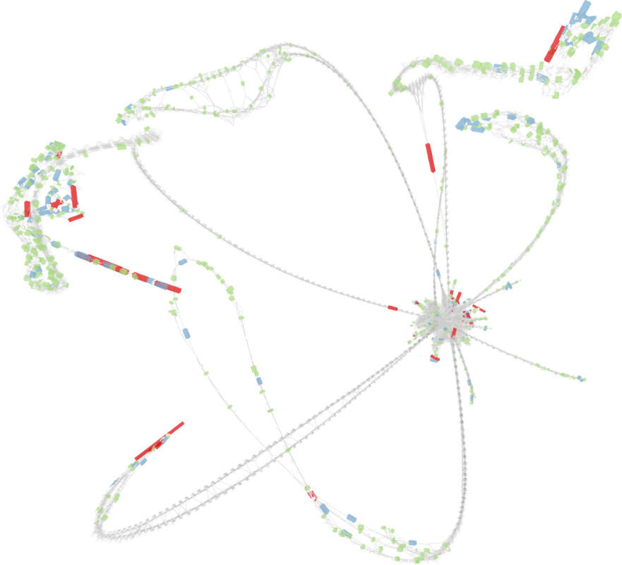
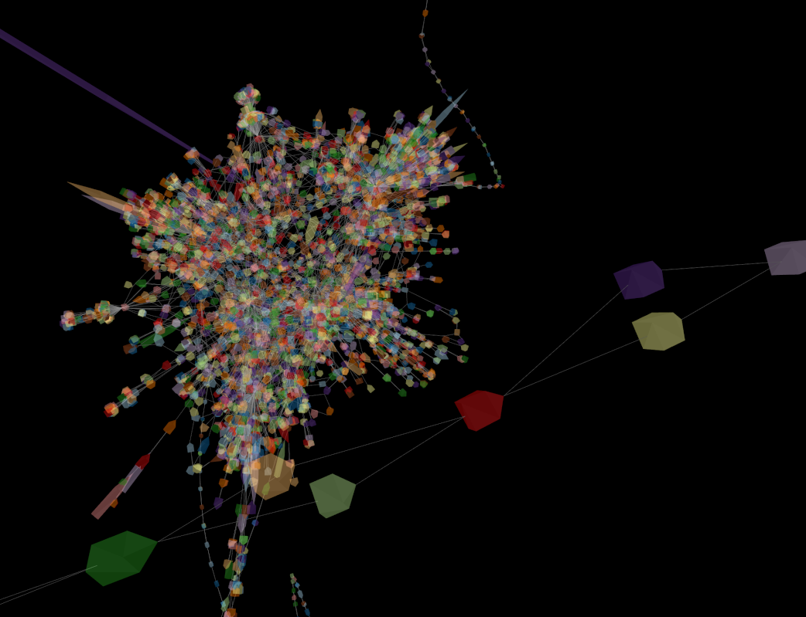
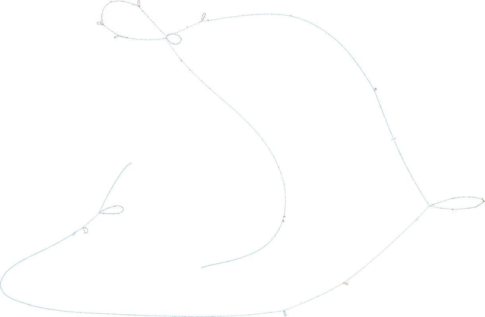
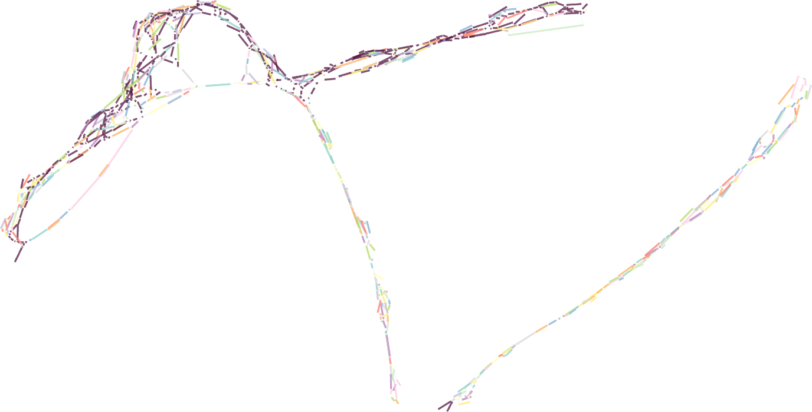

# Strange pangenome scale large graph visualization

Interactive visualization of large genome graphs
in [GFAv1 format](https://github.com/GFA-spec/GFA-spec/blob/master/GFA1.md)
à la [Bandage](https://github.com/rrwick/Bandage).

<p align="center"></p>

Named in reference to the Dr. Strangelove character
in Stanley Kubrick's __Dr. Strangelove or: how I learned to stop
worrying and love the bomb__ (1964),
strangepg provides an interactive visualization of bidirected and undirected graphs
in a familiar force-directed layout but aims to scale to hundreds of millions of nodes and beyond.
Such is the size of pangenome graphs today,
the direct application for this tool.
A big emphasis is placed on performance, reactivity and immediate feedback.
While it currently supports only GFA files as input,
it will in future be extended to support other formats (GraphML, DOT, Newick, etc)
and types of trees (Newick for phylogenetic trees, etc.).

<p align="center"></p>

_Note: this is a work in progress and under heavy development;
significant or breaking changes happen all the time,
but always prefer building from source on the latest commit to
other methods of installation in order to get the latest fixes and
additions. Git tags do **not** mark stable releases.
Please consider this to be a public beta of sorts
and feel free to send bug reports, feature requests or comments.
Thanks!_

## Table of contents

- [Features](#features)
- [TL;DR](#tldr)
- [Installation](#installation)
  + [Hardware requirements](#hardware-requirements)
  + [Software requirements](#software-requirements)
  + [Bioconda](#bioconda)
  + [Linux](#linux)
  + [MacOS](#macos)
  + [Windows (MinGW64)](#windows-mingw64)
  + [Windows (Cygwin)](#windows-cygwin)
  + [Windows (WSL2)](#windows-wsl2)
  + [OpenBSD](#openbsd)
  + [9front](#9front)
- [Usage](#usage)
  + [Command-line options](#command-line-options)
- [Layouting](#layouting)
  + [Basic layouting](#basic-layouting)
  + [Interaction](#interaction)
  + [Loading from and saving to file](#loading-from-and-saving-to-file)
- [Navigation](#navigation)
  + [2D mode](#2d-mode)
  + [3D mode](#3d-mode)
  + [Selection](#selection)
  + [Keyboard shortcuts](#keyboard-shortcuts)
- [Graph manipulation](#graph-manipulation)
  + [Examples](#examples)
  + [Quick function reference](#quick-function-reference)
- [Loading tags from CSV files](#loading-tags-from-csv-files)
  + [Format notes](#format-notes)
  + [On colors](#on-colors)
- [Example applications](#example-applications)
  + [Conga line: linear layout in GFA segments order](#conga-line-linear-layout-in-gfa-segments-order)
  + [Random coordinates](#random-coordinates)
  + [Linear layout using bubble id tags from gaftools](#linear-layout-using-bubble-id-tags-from-gaftools)
  + [Rapid visual inspection of long linear segments](#rapid_visual_inspection_of_long_linear_segments)
- [Known bugs](#bugs)
- [Used and bundled alien software](#bundled)
- [References](#references)


## Features

- Scaling to arbitrarily large graphs via coarsening (not yet merged!); expanding/retracting parts of the graph on-demand with the mouse or object lookups and commands.
- Layouting, rendering, drawing to the screen and handling user interface, file loading, graph manipulation
all in separate and independent threads to reduce any waiting time to a minimum;
immediate output and interaction whenever possible.
- Layouting is in real time and can be interrupted or influenced by moving nodes; it can be saved to or loaded from a file as a final result or an initial/reproducible state, hence guiding/improving previous layouts is possible; tags such as color can be changed at any time.
- High performance graphics with modern and efficient renderer.
- Some of the fastest GFA loading, by splitting topology from sequence/tags in separate passes;
no assumptions about ordering, type of labels (strings or integers) or tags.
- Console with an embedded graph manipulation language based on GFA tags.
- Any tags, including user-defined ones, can be loaded from the GFA file,
CSV files and in the prompt; automatic coloring if one is included.
- Custom layouting (albeit currently primitive) via special tags and a generic force-directed layout in 2D or 3D space.
- Written from scratch in C with almost no dependencies: easy and fast to build;
highly modular, extensible and cross-platform by design
(note: code including bundled header-only libs is as portable as possible and supports multiple backends,
but it still needs to be actually ported).

Without coarsening, the current layouting algorithm while a parallelized and slightly improved version of the classic Fruchterman-Reingold __[1]__ force-directed algorithm,
is still slow for 10k+ node graphs.
It will however be adequate for a coarsened graph since it only ever works on whatever is currently loaded;
other algorithms (SGD2, FM3, etc.) could later be implemented as well.
Right now, because layouting is parallelized, in real-time and can be interacted with,
not that much is left to make it more useful in practice.

Near finished:
- Online and offline coarsening and usage
- Better generic layouts with hooks for user-specific scenarios: fix circular, add spherical, etc.
- Better external memory implementation and hooks
- Manpage

Near future:
- Path handling: highlighting, coloring
- Better UI; macros as user-defined buttons
- Newick format and phylogenetic tree layouts
- Additional capabilities in the graph language
- Multiple graph handling

Future:
- Edge bundling
- Prettier graphs: node/line thickness and curvature
- Additional annotation overlays
- Better graph manipulation language
- More user-friendly layout specification/implementation
- IGV-like subviews (?)
- Further graphics performance improvements if warranted
- GBZ support

Released under the terms of the MIT license.

<p align="center"></p>


## TL;DR

Mandatory arguments: a graph in GFA format,
always as the last command line parameter.

Load a gfa file named some.gfa:

```bash
strangepg some.gfa
```

Increase number of threads for layouting:

```bash
strangepg -t 8 some.gfa
```

Select a different layout type:

```bash
strangepg -l 3d some.gfa
```

Load a CSV file named some.csv:

```bash
strangepg -c some.csv some.gfa
```

Load layout from a file named some.lay
(note: the layout file format is strangepg-specific):

```bash
strangepg -f some.lay some.gfa
```

Compute a layout offline, ie. non-interactively and without graphics, writing snapshots to a file:
```bash
strangepg -n some.lay some.gfa
# resuming from snapshot:
strangepg -f some.lay -n some.lay some.gfa
```

<p align="center"></p>

## Installation

Currently Linux, macOS, Windows, OpenBSD and Plan9front
are supported (x86, amd64, arm64).
Other BSDs might work as well, but it's untested.

Installation can be done from source or via [bioconda](https://bioconda.github.io/).
Binaries for Linux, macOS and Windows, probably out of date,
can be downloaded from the Releases github page as well.

#### Hardware requirements

strangepg requires a graphics card with certain capabilities depending
on the backend which the system it will run on uses:

- Linux: OpenGL 4.3+ (x86/amd64) or OpenGL ES 3.0+ (arm64)
- Windows: DirectX 11+ support
- macOS: Metal support

Graphics cards from around 2013 on should all be compatible.
Intel machines with Ivy Bridge or later HD Graphics work.

For arm64/aarch64, the Raspberry Pi 4 and later should work,
but so far it's unconfirmed.
It's confirmed to work on the Nintendo Switch (on Linux) however.

#### Software requirements

- Linux: OpenGL and X11 libraries, optionally EGL;
there's no native Wayland support yet
- Windows: Windows 7 or later, but might work on XP
- macOS: macOS 11 or later, but might work on OSX 10.11
- OpenBSD: gmake, everything else is included
- 9front: npe

Windows binaries are cross-compiled on Linux.
There is currently no plan for adding MSVC support.

#### Bioconda

Install conda, add the bioconda channel, then:

```bash
conda install strangepg
```

Currently Linux aarch64 builds use OpenGL ES and EGL instead of mainline OpenGL.
macOS is supported for both Intel and Apple silicon; both should work in the same way,
but the former has received much less testing.

#### Linux

Depends on: mesa (GL), X11 (XCB, Xi, Xcursor and dependencies).

Installing dependencies (command line for Ubuntu systems, adapt for your own):

```bash
apt install libbsd0 libgl-dev libglvnd-dev libglx-dev libmd0 libx11-dev libxau-dev libxcb1-dev libxcursor-dev libxdmcp-dev libxext-dev libxfixes-dev libxi-dev libxrandr-dev
```

For arm64, you might also need `libegl-dev` and/or `libgles-dev`.

Building and installing strangepg:

```bash
git clone https://github.com/qwx9/strangepg
cd strangepg
make -j install
```

_-j_ is an optional flag to enable parallel building using all available cores.
This installs the binary `strangepg`,
by default in **\$HOME/.local/bin**.
If this directory is not in your `$PATH` or a different installation directory is desired,
use the `PREFIX` make variable:

```bash
sudo make PREFIX=/usr/local install
```

**NOTE**: manual compilation with **clang is recommended** as it currently __may__ produce noticeably faster binaries.

To set the compiler, use the `CC` make variable:

```bash
make CC=clang -j install
```

Currently arm64 builds use OpenGL ES. They can be forced to use EGL as well:

```bash
make EGL=1 -j install
```

Multiple make variables may be specified at the same time.

Known to work on Ubuntu 22.04/24.04, Arch Linux and Void Linux.

#### MacOS

Native binaries using Metal can be built on both amd64 and arm64 machines.
Install the _Xcode Command Line Tools_, then clone the repository and build:

```bash
xcode-select --install

git clone https://github.com/qwx9/strangepg
cd strangepg
make -j
sudo make install
```

This will install strangepg in `/usr/local/bin` by default.
Use the `PREFIX` make variable to override it:

```bash
make PREFIX=$HOME/.local install
```

Make sure that this new installation directory is in your `PATH`.

#### Windows (MinGW64)

Native Windows binaries using DirectX11 may be produced in a Linux environment
by cross-compiling them with MinGW64.

Install `gcc-mingw-w64` (or equivalent),
make sure that `gcc-mingw-w64-x86-64-posix` is found,
then build with:

```bash
make TARGET=Win64 CC=gcc-mingw-w64-x86-64-posix -j
```

Install the `strangepg.exe` binary somewhere on your Windows system.
Since there is no Windows-specific GUI yet, you will have to run it
via a terminal (Windows includes `cmd.exe` and Powershell)
in the same way as for other systems.


#### Windows (Cygwin)

Windows binaries using OpenGL can also be built directly on Windows via Cygwin.
Tested only via MobaXterm (v24.2+, or any version with gcc 10.1+).
To build and run the Cygwin port, install the following packages
and their dependencies:

```bash
apt install make gcc-core libgl-devel libxcursor-devel libxi-devel
```

The command may be `apt` or `apt-get` depending on version.

Then run make as usual:

```bash
git clone https://github.com/qwx9/strangepg
cd strangepg
make -j install
```

This will install the binaries in `/usr/bin` by default.

It is no longer possible to build static binaries with Cygwin.
As such, strangepg can only be run from within Cygwin's environment.
In other words, the .exe files built cannot be used outside of a Cygwin (or MobaXterm) terminal.

#### Windows (WSL2)

Use the same installation procedure as with MinGW to get a native binary
using DirectX 11.
Untested, but should work.

If building the Linux version (X11+OpenGL), it may or may not work
(in tests, the success rate on identical setups is so far circa 50%).
The installation procedure is identical as with Linux above.
Where it worked, WSL2 with Ubuntu 24.04 suffered very poor performance due to upstream bugs;
for the time being, if it does in fact work, prefer Ubuntu 22.04.

#### OpenBSD

All required libraries and headers are already included in the distribution.
The only additional build dependency is `gmake`.
I tried making a BSD makefile, but some things started to get complicated,
and in the end I decided against wasting more time on that.

```sh
pkg_add -a gmake
```

Install with:

```sh
gmake -j install
```

The default `PREFIX` is `$HOME/.local`,
installing the binary in `$HOME/.local/bin`.
Change this by adding a `PREFIX=` to your gmake command line.

You might want to enable SMT/Hyperthreading or lose much of the performance.
Check the [OpenBSD FAQ](https://www.openbsd.org/faq/faq10.html#SMT)
on how and why this is disabled by default.

#### 9front

Build with _mk_ instead of _make_ in the usual manner.
Additionally requires [npe](https://git.sr.ht/~ft/npe); it's really only required to build khash.
A better solution might exist since SDL2 isn't used at all.

Currently broken until the rendering component is brought up to date.


## Usage

strangepg requires one input file as argument.
It currently only supports graphs in GFA format.

```bash
strangepg file.gfa
```

Some test examples exist in the `test/` directory.
For example:

```bash
strangepg test/02.gfa
```

<p align="center"></p>

#### Command-line options

```bash
$ strangepg -h
usage: ./strangepg [-AHMWZbhvw] [-f FILE] [-l ALG] [-n FILE] [-s LEN WIDE] [-t N] [-c FILE] FILE [CMD..]
-b             White-on-black color theme
-c FILE        Load tags from csv FILE
-f FILE        Load layout from FILE
-h             Print usage information and exit
-l ALG         Set layouting algorithm (default: pfr)
-n FILE        Run layouting headless, saving to FILE periodically
-s LEN WIDE    Set node length and width (max: 40, default: 1.0 1.0)
-t N           Set number of layouting threads (1-1024, default: 4)
-v             Print version and exit
-w             Do not wait for all files to load to start layouting
-A             Disable transparency (for performance)
-H             Enable Hi-DPI mode
-M             Enable 4x multisample anti-aliasing (MSAA)
-Z             Minimize node depth (z-axis) offsets in 2d layouts
-W             Do not suppress warning messages
ALG may be one of:
 fr            Parallelized variant of Fruchterman-Reingold (default)
 3d            Experimental 3d version of the above
```

The most important options are:

- `-l ALG`: select the [layouting algorithm](#layouting) to use.
- `-t N` sets the number of threads spawned for layouting.
It's recommended to set it to or near the number of all available cores.
Single-threaded layout algorithms will spawn them all but only use one of them.
The default should be good enough for graphs with more than 5-10 times the number of threads.

Optional input files:

- `-c FILE` [loads a CSV file](#loading-tags-from-csv-files).
It can be specified multiple times to load tags from more than one CSV file.
Each file's changes are applied on top of previous ones.
- `-f FILE` loads a layout previous saved to the file.
- `-n FILE` shunts the entire graphics and UI stack and computes a layout.
Suitable for running on headless (displayless) servers.
Snapshots are written every 10 seconds;
layouting can be resumed from one by using `-f` flag.

Additional settings:

- `-b` sets the obligatory dark theme.
- `-w` enables gottagofast mode:
begin layouting before all files are fully loaded.
Normally, because it's unknown ahead of time if there are tags
in the input GFA files or additional files (CSVs, etc.)
that may influence layouting,
layouting only begins when it is safe to assume that everything is ready.
This option completely ignores all of this
and instead signals layouting to begin immediately after all nodes and
edges have been created.
- `-W` disables suppressing warnings:
redundant edges and such are discarded, but printing warnings about this
and some other cases is too common;
this prevents printing a ton of output that may not be relevant.

<p align="center"></p>

Drawing options:

- `-s` changes the dimensions of the nodes shown on screen.
The default is a compromise between edge length, visibility, and overall layout quality.
For bigger graphs, where one has to zoom out a lot, nodes become indistinguishable.
Use this option to make nodes longer and/or wider.
This will affect new layouts somewhat,
but it's most effective when used in conjunction with `-f`.
- `-Z`: by default, nodes are placed with some slight offset in the z axis,
ie. a distance away from the viewer,
both to avoid nodes overlapping and to improve graphics performance
by allowing the GPU to perform z-buffering,
but it might look aesthetically unpleasing depending on the camera angle.
This option squishes nodes as close to each other as possible
so as to appear as if there is no depth.

Additional graphics options

- `-A`: disable transparency, trading visual quality for higher performance.
- `-H`: enable hi-DPI mode for high resolution screens (macOS only).
- `-M`: enable 4x multi-sample antialiasing (MSAA), which smooths lines
and provides much more aesthetically pleasant visuals,
at the cost of performance.

#### Notes on GFA file format

strangepg makes no assumptions about the order of records within the file,
whether nodes are interspersed with edges or not,
and what the nodes' labels look like (strings, integers, etc.).
It boasts one of the fastest and leanest GFA loading regardless,
so no preprocessing is needed.

ecords must conform to the GFAv1 standard; syntax errors are reported,
but parsing will continue if possible:

- redundant L and S records are treated as duplicates and discarded
(note, edge tags are currently unused).
For example:

	L	a	+	b	+
	L	b	-	a	-

Here, `b-a-` is seen as a duplicate of `a+b+` since
the bidirectionality is already captured by `a+b+`.
Which of the duplicate edges is kept should be considered arbitrary,
but currently the reference edge is the one with the lowest ranked left-hand node.
- the field separator is a single tab character;
two successive ones are treated as an empty field.
- nodes must have a non-empty sequence field which cannot exceed 128k characters.

<p align="center"></p>

## Layouting

Layouting is performed and visualized in real time and in parallel.
Currently all available layout algorithms are based on a spring model force-directed approach,
and are variations of the classic Fruchterman-Reingold algorithm __[1]__.
They are slow (improvements underway).
Parameters and heuristics are hand-tuned and may require further adjustment
for better results, or may warrant better approaches.
Because the initial state is random, results are different every time,
and due to trade-offs for speed some may be better than others.
The real-time aspect of the application allows the user to easily restart layouting
if the result so far is unsatisfactory, or to guide it by loading more information
or moving nodes manually.

Here the approach to custom or application-specific layouting is
to combine a basic layout algorithm with specifying a partial or full initial state
and/or adding constraints.
For example, a linear layout may be achieved by fixing the x coordinate of some or all nodes to one or more constant values.
3D layouting works in the same way -- all layouts are actually in 3D space,
but 2D algorithms ignore the 3rd axis.
Reproducible layouting is possible by saving layouts to file and later loading them again.

The basic layouting algorithm serves as a backbone for more specific visualizations,
changing the type of geometry: circular, spherical, non-euclidean, etc.
These basic additional layouts are currently under development.

**Note**: to accomodate for navigating in 3 dimensions rather than only 2,
[navigation](#navigation) in 3D layouts is different.

<p align="center"></p>

#### Basic layouting

Available algorithms:
- `-l fr`: the default, a slightly optimized and parallelized version
of the original algorithm. The time complexity is essentially the same,
so while it may run faster, it will not scale on its own for 10k node graphs and beyond.
Because it splits the graph across threads, it will produce nonsense results
if the number of nodes is less than 2-3 times the number of threads.
- `-l 3d`: same as `fr` but additionally using the z axis to layout in 3D.

Use the [`-t` command line parameter](#usage) to change the number of threads
used for layouting, 4 by default.
Single threaded algorithms will always only use one of them.

Due to a bug, graphs are not locked to the center of the screen
and may jump around during layouting if they're too small.
If there's nothing on the screen, try zooming out or re-layouting.

#### Interaction

The following keyboard shortcuts are available:
- `r`: restart layouting from scratch
- `p`: stop layouting, or restart from current state
- `Esc`: reset position on screen

Nodes may be dragged around with the mouse.
Moving nodes does not fix their position to a constant position,
and if layouting is currently underway it will influence the layout as a whole.
Node positions are fixed via [tags](#graph-manipulation) instead.

Restarting it is cheap; try it if the layout doesn't look good.
Intermediate or final results can be saved to file,
then used as an initial state for another round of layouting.

<p align="center"></p>


#### Loading from and saving to file

A pre-existing layout file may be loaded with the [`-f` command line parameter](#usage),
irrespective of the selected layout algorithm.
The file format is binary and specific to strangepg.
Currently it's assumed that the layout file contains the exact same number
of segments (S records) and in the __same order of appearance__
(in either S or L records) as the originating GFA.

The current layout may be exported or imported at runtime
with the `exportlayout("file")` and `importlayout("file")` functions
(see [Graph manipulation](#graph-manipulation)).

<p align="center"></p>


## Navigation

Moving the graph around is done primarily with the mouse.
There are two styles of navigation, 2D and 3D, determined by the layout type.

#### 2D mode

In 2D, the view (camera) can be moved vertically and horizontally (pan),
or zoomed in and out (depth).
The maximal zoom level is right on top of the graph (ie. it cannot go behind it).

Controls:

- Left click: select object (click on nothing to deselect).
Click and hold to move a node around.
- Shift (or Control) + left click on object: toggle selection for a single node
- Right click (hold): pan the screen horizontally and/or vertically.
- Left + right click (hold): zoom in by pulling in (drag mouse toward bottom right corner),
or zoom out by pushing away (drag mouse toward upper left corner).
- Scrollwheel: zoom in or out.
- Control + right click (hold): zoom in or out.

Use `Esc` to reset the view.

#### 3D mode

The graph is locked to a center point, and the camera moves around it.
Simply put, one rotates the graph around a center point as if it were a ball,
and zooms in or out towards its center.

Controls:

- Left click: select object (click on nothing to deselect).
Click and hold to move a node around.
- Shift (or Control) + left click on object: toggle selection for a single node
- Right click (hold): rotate the graph around its center.
- Left + right click (hold): zoom in by pulling in (drag mouse toward bottom right corner),
or zoom out by pushing away (drag mouse toward upper left corner).
- Scrollwheel: zoom in or out.
- Control + right click (hold): zoom in or out.
- Middle click (hold): rotate the view instead of the graph.

Use `Esc` to reset the view.


#### Selection

Selection is done either with the left mouse button, or through [commands](#graph-manipulation).
Clicking on a node selects it, deselecting everything else.
Clicking while holding the shift or control key toggles its selection,
ie. adds or removes it to the current selection.
Dragging a selection box selects all intersecting nodes
(current implementation is [very limited](#known-bugs)).
Clicking on empty space deselects everything.

Nodes can be dragged around by clicking and holding the left mouse button.
Currently, only one node can be moved at a time.


#### Keyboard shortcuts:

- `Esc`: Reset view to initial position.
- `a`: Toggle showing oriented nodes as arrows (oriented in read direction).
- `p`: Pause/unpause layout (unpause = restart layout from current state).
- `r`: Restart layouting from scratch.
- `q`: Quit.
- Arrow keys: move view by 1/3 of the screen up/down/left/right.

<p align="center"></p>

A status window currently labeled `Prompt`
presents a text box to write [commands](#graph-manipulation) in,
and shows selected and hovered over objects.
Currently, it only shows the name and length (nodes)
or endpoints, orientation and overlap (edges),
but will be extended to show all of a node's tags.

The window can be moved around with the mouse,
collapsed by clicking the top right button,
or resized by dragging the lower right corner.
It now also shows the last 3 status messages and command outputs,
and has a collapsible message log widget for more.
Feedback from [commands](#graph-manipulation) will appear here.
Error messages are drawn in red.

<p align="center"></p>


## Graph manipulation

strangepg embeds a simple graph manipulation language,
which presents GFA tags as tables (associative arrays)
and provides means to manipulate the graph and its
properties via those and additional tags.
Using it involves typing commands in the text prompt
of the status window.

Whenever a node's tag is loaded from a GFA or CSV file or
on the prompt, the table with the same name is updated with
the new value.
For example, in GFA files the `LN` tag indicates the length of a
node's sequence.
Upon loading the GFA file, each S line with a non-empty sequence
and/or an `LN` tag will add an element to the `LN` table.
`LN[name]` then stores the value for a node labeled `name` in the GFA.
This can be used for instance to change the color of a node
depending on some condition such as `LN[name] < 1000`
(more examples below).

The editing box is currently ugly and inconvenient due to limitations
of the UI framework used, but this will be fixed soon.
It has supports mouse highlighting and selection
and has clipboard support, with shortcuts Ctrl-C for copy and Ctrl-V for paste.
For X11, only the primary clipboard is currently used.

The language is a fork of [_awk_](https://awk.dev),
hacked up to evaluate commands interactively.
Any awk code valid within a pattern or function (ie. inside braces)
is also valid here.
New functions may not yet be defined.
Currently, it's somewhat limited and a bit hacky, but it works.
It will be improved later on.

<p align="center"></p>

#### Examples

Color nodes with labels matching a regular expression:
```awk
CL[i ~ /chr13/] = green
```

Color nodes with sequence length > 50:
```awk
CL[LN[i] > 50] = darkgreen
```

Color nodes which have a certain tag defined:
```awk
CL[i in CN] = purple
```

Color a specific node:
```awk
nodecolor("s1", red)
# also works but will loop through all nodes:
CL[i == "s1"] = red
```

Color 42th node in order of appearance in GFA (in S or L records):
```awk
nodecolor(label[42], blue)
# also works but will loop through all nodes:
CL[node[i] == 42] = blue
```

Color every other node:
```awk
CL[node[i] % 2 == 1] = orange
```

Look up a node by name, zooming in and centering on it if it exists:
```awk
findnode("s14")
```

Save current layout to file:
```awk
exportlayout("filepath")
```

Load existing layout from file:
```awk
importlayout("filepath")
```

Read in [a CSV file](#loading-tags-from-csv-files):
```awk
readcsv("filepath")
```

See [strawk.md](strawk.md) for a more detailed overview.


#### Quick function reference

```awk
nodecolor(name, color)     change a node's color
findnode(name)             zoom onto and select a node
quit()                     give up
```

Layouts:

```awk
explode(name)              add random jitter to a node or to the selection if no name is given
fixx(name, x)              force node to a fixed x coordinate
fixy(name, y)              force node to a fixed y coordinate
```

Files:

```awk
readcsv(path)              read a csv file
exportlayou(path)          export layout to file
importlayout(path)         import layout from file
```

Paths are absolute or relative to the current working directory.


## Loading tags from CSV files

CSV files can be loaded at start up with the `-c` flag or at runtime
to feed or modify tags for existing nodes.
The '-c' flag may be used multiple times to load more than one CSV file at startup.

The first column is always reserved for node labels, and all subsequent columns are tags values.
The first line must be a header specifying a tag name for each column.

For example:
```
Node,CN,CO,CL
utig4-142,1,55231,purple
utig4-143,0,53,red
...
```

The name of the first column does not matter.
The `CL` tag is used as a node's color and can thus also be set in this way.
`Color` can also be used (in any casing).
Node labels must refer to existing nodes from the input GFA file.

A CSV file may be loaded at runtime with the `readcsv("file.csv")` command
(see [Graph manipulation](#graph-manipulation)).

**Loading multiple CSV files one after the other is allowed.**
In other words, variables such as color are not reset between files.
CSV files thus needn't be merged together.
It cannot be undone however,
but once colors are known, selections can be made based on them.

<p align="center"></p>

#### Format notes

The accepted format here is more stringent than usual.
The implementation is not localized, ie. commas are always field separators.
There are no escape sequences or special quoting rules, ie. quotes are not special characters.
Line breaks within a field are disallowed.
Lines must be terminated with a new line (LF) character, ie. the return character (CR) is not handled.
Spaces in the column names of header are allowed;
extra spaces preceding or following each name are stripped.
Each line must have the same number of fields as the header, but fields may be empty.

#### On colors

Colors are represented as integers in RGBA32 format.
Some names such as `red`, `darkblue` or `palegreen` are predefined (see [strawk document](strawk.md) for a list).
In strawk, the alpha component (transparency) is 0 by default.
For example, the color `orange` is set to `0xFF7F0000` (in RRGGBBAA format in hexadecimal).
The actual alpha value depends on the theme, but it can be overridden by setting a value different than 0.
For example:

```awk
red = 0xff00007f      # 50% opacity
mycolor = 0x123456ff  # full opacity
```

Colors in CSV files don't need to specify an alpha value.
They can be HTML colors like `#FF0000`,
hexadecimal ones like `0xff0000`,
and symbolic ones like `blue` or `purple`.
HTML colors with an alpha value will keep it.
Once loaded in strawk, they will be represented in the above format.

For example, with the following CSV file:

	Name,CL
	s1,blue
	s2,#1F78B4
	s3,#1F78B4FF
	s4,#1f78b4ff
	s5,0x1f78b4ff
	s6,0x1f78b400

Nodes `s1` to `s6` will all have the same color and transparency,
except `s3` to `s5` are set to full opacity.

The same rules apply to GFA file tags.

<p align="center"></p>


## Example applications

One of the goals of strangepg is to enable experimentation with layouting.
Currently, the default layouting algorithm honors a set of tags
which set initial coordinates and/or fixes them (makes them unmovable).

- **x0:f:xpos**	set initial x coordinate in layout
- **y0:f:ypos**	set initial y coordinate in layout
- **fx:f:xpos**	force immutable x coordinate
- **fy:f:ypos**	force immutable y coordinate

They can be loaded from the GFA itself, from CSV or live by using the prompt.

See [strawk.md](strawk.md) for a more detailed overview.

#### Conga line: linear layout in GFA segments order

```awk
fx[1] = 8 * node[i]
fy[1] = 0
```

#### Random coordinates

```awk
fx[1] = 8 * 1024 * node[i]
fy[1] = 8 * 1280 * rand()
```

#### Linear layout using bubble id tags from [gaftools](https://github.com/marschall-lab/gaftools)

```awk
min = 999999
max = -999999
for(i in BO) if(BO[i] < min) min = BO[i]; if(BO[i] > max) max = BO[i]
fx[CL[i] == orange] = 8 * (BO[i] - min - (max - min) / 2)
fy[CL[i] == orange] = 0
x0[CL[i] != orange] = 8 * (BO[i] - min - (max - min) / 2)
y0[CL[i] != orange] = 2 - 4 * rand()
```

<p align="center"></p>

#### Rapid visual inspection of long linear segments

The objective is to visually verify the absence of certain nodes within a region of interest.
Other existing programs may make it difficult to accomplish due to a limited interface,
or a layout producing too many overlaps, masking potential sites.
strangepg attempts to maintain some separation between nodes
and offers a relatively simple solution with partial 3d layouting.
The layout is partially computed on a server with 64 cores,
ie. run once for a limited period of time.
A csv file colors the region in yellow (#fbff00) and critical nodes in red (#ff0000).
Nodes are enlarged to make them easier to distinguish and all nodes not in the csv
are colored in light gray.
The random colors and default node dimensions make it difficult to see what is happening,
but we can use a simple command to color all nodes not mentioned in the CSV file.
We'll append the command to the command line so as to not have to type it in the prompt;
this approach works well with scripts.

```bash
strangepg \
        -s 8 8 \
        -M \
        -l 3d \
        -c ~/chr17_16823490-18384190_0.csv \
        -f chr17_16823490-18384190_10000.gfa \
        chr17_16823490-18384190_10000.gfa \
        'CL[CL[i] != 0xfbff0000 && CL[i] != 0xff000000] = 0xeeeeee10'
```

<p align="center"></p>


## Known bugs

Major bugs:
- Layouting is slow and larger graphs show up as a ball at the center of the screen:
this is the initial state for any of the layouting algorithms,
but because it is shown in real time and the algorithms currently used being slow
(improvements underway), the initial plot looks... underwhelming.
- Graphs are not re-centered or locked to the center of the screen;
either the algorithm should compensate for random movements beyond what the FR
algorithm does, or it should be translated to the center of the screen, or
the screen to the center of the graph.
- Edges are ugly and are 1 pixel-wide lines, making them difficult to select.
- Self-edges aren't drawn well. An `a+a+` edge will appear as a line inside the node,
and a `a+a-` edge will be a dot at the end of the node (in read direction).

Less major bugs:
- strawk could still use less memory and be faster; its language is very limited;
yet to be hooked up to external memory.
- The selection box is a kludge and is stupidly resource-heavy.
- The selection box is currently not drawn and only works in one direction.
- Only one node can be moved at a time.
- 3d navigation still suffers from some bugs (roll angle especially).
- The renderer is fairly efficient, but it could be made an order of magnitude faster.
- (pfr*) Layouting ignores nodes with no adjacencies; would be better to
place them on better fixed locations as well.
- The text boxes suck, a lot. Nuklear doesn't handle edit boxes much.
- strawk leaks about 200 bytes during initialization.
- ... and many more!


## Used and bundled alien software

Data structures:
- [khashl](https://github.com/attractivechaos/khashl),
modified to use readers-writer locks for concurrent access
- [chan](https://github.com/tylertreat/chan)

Linux graphics:
- sokol_gfx, sokol_app, sokol_nuklear and glue code from [sokol](https://github.com/floooh/sokol)
- [HandmadeMath](https://github.com/StrangeZak/Handmade-Math)
- [Nuklear](https://github.com/Immediate-Mode-UI/Nuklear)

Used but not bundled:
- GNU Bison or Plan9 yacc(1) for strawk

strawk is based on [onetrueawk](https://github.com/onetrueawk/awk).

<p align="center"></p>

_Soon, deathmatching in graph space_


## References

[1] Fruchterman, Thomas M. J.; Reingold, Edward M. (1991), "Graph Drawing by Force-Directed Placement", Software: Practice and Experience, 21 (11), Wiley: 1129–1164, doi:10.1002/spe.4380211102, S2CID 31468174
